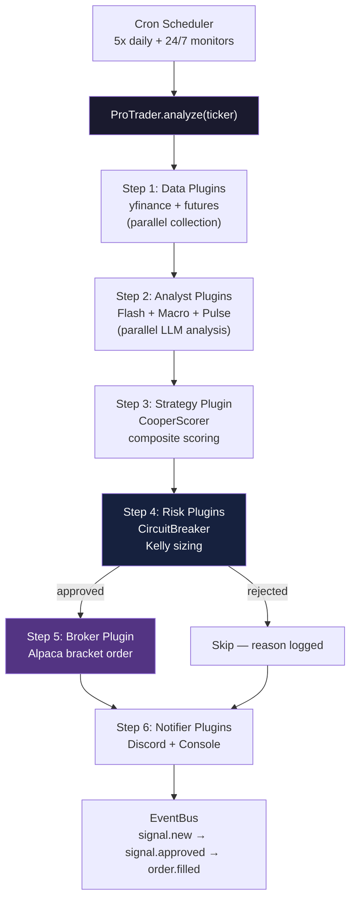

# Pro-Trader — Plugin-Based Autonomous Trading Framework

> **pip-installable core + modular plugin system + deployable service layer**
>
> Paper trading via Alpaca · 12 built-in plugins · OpenClaw v2026.3.8 compatible

[](https://python.org)
[](https://github.com/oabdelmaksoud/Pro-Trader-SKILL)
[](https://github.com/openclaw/openclaw)
[](LICENSE)

---

## What Is This?

Pro-Trader is a **plugin-based autonomous trading framework** that replaces monolithic trading scripts with a composable architecture. Every capability — data sources, analysts, strategies, brokers, risk management, monitors, and notifiers — is a self-contained plugin.

```python
from pro_trader import ProTrader

trader = ProTrader()
signal = trader.analyze("/METH26")     # Micro Ether futures
signals = trader.scan(["NVDA", "SPY"]) # Multi-ticker scan
trader.plugins.disable("discord")      # Runtime plugin control
```

### Key Features

- **Plugin Architecture** — 7 plugin types, auto-discovery via setuptools entry_points, third-party extensible
- **Futures + Equities** — 13 micro futures contracts + standard equities, unified pipeline
- **Multi-Agent Analysis** — Flash (technical), Macro (fundamental), Pulse (sentiment) in parallel
- **Bull/Bear Debate** — Multi-round argument engine with Claude Opus adjudication
- **9-Gate Risk System** — Drawdown halt, Kelly sizing, correlation filter, earnings guard
- **OpenClaw Discord** — Real-time signal cards via openclaw v2026.3.8 CLI
- **Background Monitors** — Breaking news (RSS + Finnhub), FOMC proximity, futures sessions
- **Learning Loop** — BM25 memory, post-trade reflection, rolling Kelly calibration
- **Dashboard** — Real-time SSE at localhost:8002
- **Docker Ready** — `docker build -t pro-trader . && docker run pro-trader`

---

## Architecture

### Three-Layer Design

```
┌─────────────────────────────────────────────────────────────────┐
│  Layer 3: SERVICE LAYER                                         │
│  ┌──────────┐  ┌──────────────┐  ┌───────────┐  ┌───────────┐ │
│  │ CLI      │  │ Discord Bot  │  │ Dashboard │  │ Docker    │ │
│  │ pro-trader│  │ via OpenClaw │  │ SSE/REST  │  │ Container │ │
│  └──────────┘  └──────────────┘  └───────────┘  └───────────┘ │
├─────────────────────────────────────────────────────────────────┤
│  Layer 2: PLUGINS (12 built-in, third-party extensible)        │
│                                                                 │
│  DATA        ANALYSTS     STRATEGY     BROKERS                 │
│  ├ yfinance  ├ flash      ├ cooper     ├ alpaca                │
│  └ futures   ├ macro      │ scorer     │                       │
│              └ pulse      │            │                       │
│                                                                 │
│  RISK        MONITORS     NOTIFIERS                            │
│  ├ circuit   ├ news       ├ discord                            │
│  │ breaker   ├ fomc       └ console                            │
│              └ futures                                          │
├─────────────────────────────────────────────────────────────────┤
│  Layer 1: CORE LIBRARY                                         │
│  ┌────────────┐ ┌──────────┐ ┌──────────┐ ┌─────────┐        │
│  │ Interfaces │ │ Registry │ │ EventBus │ │ Config  │        │
│  │ 7 ABCs     │ │ auto-    │ │ pub/sub  │ │ cascade │        │
│  │            │ │ discover │ │          │ │         │        │
│  └────────────┘ └──────────┘ └──────────┘ └─────────┘        │
│  ┌────────────┐ ┌──────────────────────────────────────┐      │
│  │ Pipeline   │ │ Models: Signal, MarketData, Quote,   │      │
│  │ Orchestr.  │ │ Technicals, Position, Portfolio,     │      │
│  │            │ │ FuturesContract, Order, OrderResult   │      │
│  └────────────┘ └──────────────────────────────────────┘      │
└─────────────────────────────────────────────────────────────────┘
```

### Plugin Interfaces

| Interface | Purpose | Methods |
|-----------|---------|---------|
| `DataPlugin` | Market data sources | `get_quote()`, `get_technicals()`, `get_fundamentals()`, `get_news()` |
| `AnalystPlugin` | AI analysis agents | `analyze(data) -> report` |
| `StrategyPlugin` | Scoring/signal generation | `evaluate(data, reports) -> Signal` |
| `BrokerPlugin` | Trade execution | `submit_order()`, `get_positions()`, `get_portfolio()` |
| `RiskPlugin` | Risk gate checks | `evaluate(signal, portfolio) -> verdict` |
| `MonitorPlugin` | Background monitoring | `check() -> alerts` |
| `NotifierPlugin` | Alert delivery | `notify(signal)`, `notify_alert(alert)` |

### Pipeline Flow

```
Data Plugins ──→ Analyst Plugins ──→ Strategy Plugin ──→ Risk Plugins ──→ Broker ──→ Notifiers
  (parallel)       (parallel)          (scoring)         (gates)        (execute)   (alerts)
  yfinance         Flash               CooperScorer      CircuitBreaker  Alpaca      Discord
  futures          Macro                                                             Console
                   Pulse
```

### Event Bus

Plugins communicate via events, not imports:

```python
trader.on("signal.new", lambda signal: print(f"New signal: {signal.ticker}"))
trader.on("order.filled", lambda order, result: log_trade(result))
trader.on("monitor.alert", lambda alert: escalate(alert))
```

Built-in events: `data.complete`, `analyst.complete`, `signal.new`, `signal.approved`, `signal.rejected`, `order.submitted`, `order.filled`, `monitor.alert`, `risk.halt`, `pipeline.start`, `pipeline.complete`

---

## Installation

```bash
# Core only (data + scoring, no LLM agents)
pip install pro-trader

# With LLM agents (Flash/Macro/Pulse + debate engine)
pip install pro-trader[agents]

# Everything (agents + broker + monitors + dashboard)
pip install pro-trader[all]

# Legacy compatibility (includes tradingagents framework)
pip install pro-trader[legacy]
```

### From Source

```bash
git clone https://github.com/oabdelmaksoud/Pro-Trader-SKILL.git
cd Pro-Trader-SKILL
pip install -e ".[all]"
```

### Docker

```bash
docker build -t pro-trader .
docker run -e ANTHROPIC_API_KEY=... -e ALPACA_API_KEY=... pro-trader
```

---

## Quick Start

### CLI

```bash
# Analyze a single ticker
pro-trader analyze NVDA

# Analyze a futures contract
pro-trader analyze /METH26

# Scan watchlist
pro-trader scan --watchlist

# List all plugins
pro-trader plugin list

# Check plugin health
pro-trader plugin health

# Run monitors
pro-trader monitor check

# Show config
pro-trader config
```

### Python API

```python
from pro_trader import ProTrader

# Initialize with custom config
trader = ProTrader(config={
    "account_value": 500,
    "llm_provider": "anthropic",
    "score_threshold": 7.0,
})

# Analyze futures
signal = trader.analyze("/METH26", dry_run=True)
print(f"{signal.ticker}: {signal.direction.value} score={signal.score}")

# Scan multiple tickers
signals = trader.scan(["/METH26", "/M6EH26", "NVDA", "SPY"])
for s in signals:
    print(f"  {s.ticker}: {s.score:.1f} {'THRESHOLD MET' if s.meets_threshold else ''}")

# Plugin management
trader.plugins.disable("discord")
trader.plugins.enable("discord")
print(trader.health())

# Event hooks
trader.on("signal.new", lambda signal: print(f"Signal: {signal.ticker}"))
```

### Writing a Custom Plugin

```python
from pro_trader.core.interfaces import DataPlugin
from pro_trader.models.market_data import Quote

class MyDataPlugin(DataPlugin):
    name = "my_source"
    version = "1.0.0"
    provides = ["quotes"]

    def get_quote(self, symbol):
        # Your data source here
        return Quote(symbol=symbol, price=100.0, source="my_source")

    def get_technicals(self, symbol, period="3mo"):
        return None

# Register it
from pro_trader import ProTrader
trader = ProTrader()
trader.register(MyDataPlugin())
```

Third-party plugins register via `pyproject.toml` entry_points:

```toml
[project.entry-points."pro_trader.data"]
my_source = "my_package:MyDataPlugin"
```

---

## Built-in Plugins

### Data Plugins

| Plugin | Source | Symbols | Features |
|--------|--------|---------|----------|
| `yfinance` | Yahoo Finance | Equities, ETFs | Quotes, technicals, fundamentals, news |
| `futures` | CME via proxy | 13 micro futures | Contract specs, margin calc, session hours |

#### Supported Futures Contracts ($500 Account)

| Contract | Margin | Headroom | Asset Class |
|----------|--------|----------|-------------|
| `/MET` Micro Ether | $77 | 84.6% | Crypto |
| `/MCD` Micro CAD | $110 | 78.0% | FX |
| `/M6A` Micro AUD | $209 | 58.2% | FX |
| `/M6B` Micro GBP | $220 | 56.0% | FX |
| `/M6E` Micro EUR | $297 | 40.6% | FX |
| `/BFF` Bitcoin Friday | $365 | — | Crypto |
| `/1OZ` 1oz Gold | $472 | — | Commodity |
| `/MSF` Micro CHF | $495 | — | FX |
| `/MNG` Micro NatGas | $633 | — | Commodity |
| `/MES` Micro S&P 500 | $1,500 | — | Index |
| `/MNQ` Micro Nasdaq | $2,000 | — | Index |
| `/MYM` Micro Dow | $1,000 | — | Index |
| `/MCL` Micro Crude | $800 | — | Commodity |

### Analyst Plugins

| Plugin | Model | Role |
|--------|-------|------|
| `flash` | claude-sonnet-4-6 | Technical analysis (MACD, BB, RSI, VWAP) |
| `macro` | claude-sonnet-4-6 | Fundamentals, news, economic calendar |
| `pulse` | claude-sonnet-4-6 | Sentiment, options flow, COT data |

### Strategy, Risk, Monitor, Notifier Plugins

| Category | Plugin | Description |
|----------|--------|-------------|
| Strategy | `cooper_scorer` | Composite scoring with futures bonuses |
| Risk | `circuit_breaker` | Drawdown halt at 5% + daily loss limit |
| Monitor | `news` | RSS feeds + Finnhub every 2 min |
| Monitor | `fomc` | FOMC meeting proximity alerts |
| Monitor | `futures_monitor` | Session times, margin changes, rollovers |
| Notifier | `discord` | Signal cards via openclaw v2026.3.8 |
| Notifier | `console` | Terminal output |
| Broker | `alpaca` | Paper/live trading |

---

## Full Trading Pipeline



---

## Agent Roster

| Agent | Model | Role | Plugin |
|-------|-------|------|--------|
| Flash | claude-sonnet-4-6 | Technical analysis | `pro_trader.plugins.analysts.flash_analyst` |
| Macro | claude-sonnet-4-6 | Fundamentals + news | `pro_trader.plugins.analysts.macro_analyst` |
| Pulse | claude-sonnet-4-6 | Sentiment + options | `pro_trader.plugins.analysts.pulse_analyst` |
| Bull | claude-opus-4-6 | Bullish debate | via debate engine |
| Bear | claude-opus-4-6 | Bearish debate | via debate engine |

---

## Five Framework Gap Closures

Built on [TauricResearch/TradingAgents](https://github.com/TauricResearch/TradingAgents) with 5 gaps closed:

| # | Gap | Module | Description |
|---|-----|--------|-------------|
| 1 | Persistent BM25 Memory | `tradingagents/memory/situation_memory.py` | 500-entry JSON store, top-3 retrieval before debate |
| 2 | Post-Trade Reflection | `scripts/reflect_on_trade.py` | Async LLM reflection writes lessons to BM25 store |
| 3 | Research Manager Synthesis | `tradingagents/agents/managers/research_synthesizer.py` | Resolves analyst contradictions before debate |
| 4 | Multi-Round Debate Engine | `tradingagents/graph/debate_engine.py` | Bull/Bear 2-round debate, Opus adjudication |
| 5 | Signal Processing Layer | `tradingagents/graph/signal_processor.py` | Structured signal extraction for trade gate |

---

## Trade Execution Rules

### Entry Thresholds
| Window | Min Score | Min Conviction |
|--------|-----------|----------------|
| 9:30 AM - 1:00 PM | 7.0 | 7 |
| 1:00 PM - 2:30 PM | 7.5 | 8 |
| After 2:30 PM | No new entries | — |
| Extended hours | 7.5 | 8 |
| News catalyst | 6.5 | 7 |

### Risk Management
| Rule | Value |
|------|-------|
| Stop loss | -3% trailing |
| Take profit | +8% |
| Partial exit | 50% at +5% |
| Max positions | 2 (equities) / 1 (futures recovery) |
| Kelly sizing | Half-Kelly from rolling 30-trade win rate |
| Drawdown halt | Portfolio down 5%+ |
| Futures margin cap | 60% of account |
| Futures margin buffer | 1.5x |

---

## OpenClaw Integration

Pro-Trader uses [OpenClaw](https://github.com/openclaw/openclaw) (v2026.3.8) exclusively as a **Discord messaging bridge**:

```python
from pro_trader.services.openclaw import send_discord, CHANNELS

# Send to war room
send_discord("war_room", "Signal: BUY NVDA score 8.5")

# Send async (non-blocking)
from pro_trader.services.openclaw import send_discord_async
send_discord_async("paper_trades", "Trade executed")

# Cron management
from pro_trader.services.openclaw import list_cron_jobs, trigger_cron_job
jobs = list_cron_jobs()
```

### Compatibility

| Version | Status | Notes |
|---------|--------|-------|
| v2026.3.8 | Tested | Latest stable (March 9, 2026). Cron replay limits improve wake_recovery. |
| v2026.3.7 | Compatible | `gateway.auth.mode` change doesn't affect CLI send. |
| v2026.3.2 | Compatible | `tools.profile` and `registerHttpHandler` changes are gateway-level only. |

Graceful degradation: if openclaw is not installed, all notifications silently skip.

### Discord Channels

| Channel | ID | Purpose |
|---------|----|---------|
| War Room | `1469763123010342953` | Analysis, signals, system status |
| Paper Trades | `1468597633756037385` | Trade entries/exits |
| Winning Trades | `1468620383019077744` | Closed winners |
| Losing Trades | `1468620412849229825` | Closed losses |
| Cooper Study | `1468621074999541810` | Research, reviews |

---

## Configuration

### Config Cascade (highest priority wins)
1. CLI arguments / `ProTrader(config={...})`
2. Environment variables (`PROTRADER_*`)
3. `config/strategy.json` / `config/plugins.json`
4. Plugin defaults
5. Built-in defaults

### Environment Variables
```env
# Broker
ALPACA_API_KEY=your_key
ALPACA_SECRET_KEY=your_secret
ALPACA_BASE_URL=https://paper-api.alpaca.markets

# Data
FINNHUB_API_KEY=your_key

# LLM
ANTHROPIC_API_KEY=your_key

# Pro-Trader overrides
PROTRADER_LLM_PROVIDER=anthropic
PROTRADER_ACCOUNT_VALUE=500
PROTRADER_FUTURES__MAX_CONTRACTS=1
```

### Plugin Config (`config/strategy.json`)
```json
{
  "watchlist": {
    "futures_affordable": ["/MET", "/MCD", "/M6A", "/M6B", "/M6E"],
    "futures_index": ["/MES", "/MNQ", "/MYM", "/MCL"],
    "equities": ["NVDA", "AAPL", "SPY"]
  },
  "futures_position": {
    "max_contracts": 1,
    "max_margin_pct": 0.60,
    "stop_ticks_default": 20,
    "margin_buffer_pct": 1.5
  }
}
```

---

## Project Structure

```
Pro-Trader-SKILL/
├── pro_trader/                    # NEW: Plugin framework
│   ├── __init__.py                # ProTrader public API
│   ├── core/
│   │   ├── interfaces.py          # 7 plugin ABCs
│   │   ├── registry.py            # Auto-discovery + registration
│   │   ├── events.py              # Pub/sub event bus
│   │   ├── config.py              # Cascading config
│   │   ├── pipeline.py            # Pipeline orchestrator
│   │   └── trader.py              # ProTrader main class
│   ├── models/
│   │   ├── signal.py              # Signal dataclass
│   │   ├── market_data.py         # MarketData, Quote, Technicals
│   │   ├── position.py            # Position, Order, Portfolio
│   │   └── contract.py            # FuturesContract
│   ├── plugins/
│   │   ├── data/                  # yfinance, futures
│   │   ├── analysts/              # flash, macro, pulse
│   │   ├── strategies/            # cooper_scorer
│   │   ├── brokers/               # alpaca
│   │   ├── risk/                  # circuit_breaker
│   │   ├── monitors/              # news, fomc, futures
│   │   └── notifiers/             # discord, console
│   ├── cli/app.py                 # Typer CLI
│   └── services/openclaw.py       # OpenClaw v2026.3.8 integration
├── tradingagents/                 # Legacy: LangGraph multi-agent framework
│   ├── agents/                    # LangChain agent definitions
│   ├── dataflows/                 # Data source implementations
│   ├── graph/                     # Trading graph + debate engine
│   ├── risk/                      # Risk management modules
│   └── ...
├── scripts/                       # Standalone scripts (cron-driven)
├── config/strategy.json           # Strategy + watchlist config
├── dashboard/                     # Real-time SSE dashboard
├── Dockerfile                     # Production container
└── pyproject.toml                 # Package config with entry_points
```

---

## Data Sources (15+)

| Source | Data | Access |
|--------|------|--------|
| yfinance | Quotes, technicals, fundamentals, news | Free |
| Alpaca WebSocket | Real-time quotes | API key |
| Finnhub | News, earnings, company-news | API key |
| SEC EDGAR | 13F filings, Form 4 insider trades | Free |
| House/Senate Stock Watcher | Congressional trade disclosures | Free RSS |
| Finviz | Short interest | Free |
| GuruFocus RSS | Guru news signals | Free |
| 20 RSS Feeds | Reuters, CNBC, Bloomberg, etc. | Free |
| CME (via proxy) | Futures quotes, contract specs | Free |

---

## System Rules

1. **Live data always** — run `quick_quote.py` before answering market questions
2. **`openclaw oracle` does not exist** — use `claude --print --model <model>`
3. **Graceful degradation** — every API call in try/except; system never crashes
4. **Dedup TTL = 4h** — news dedup auto-refreshes
5. **Reflection is async** — `Popen`, not `run` — never blocks position close
6. **Guru bonus injects before gate** — can push marginal score over threshold
7. **Plugin-first** — new capabilities should be plugins, not loose scripts
8. **Models are dataclasses** — type safety throughout, not dicts
9. **Events for communication** — plugins don't import each other

---

## Built On

- [OpenClaw](https://github.com/openclaw/openclaw) v2026.3.8 — Discord messaging, cron scheduling
- [TauricResearch/TradingAgents](https://github.com/TauricResearch/TradingAgents) — base multi-agent framework (5 gaps closed)
- [Alpaca Markets](https://alpaca.markets) — paper + live trade execution
- [Finnhub](https://finnhub.io) — real-time financial data

---

*Pro-Trader Plugin Framework v1.0.0 · Last updated: 2026-03-10*
