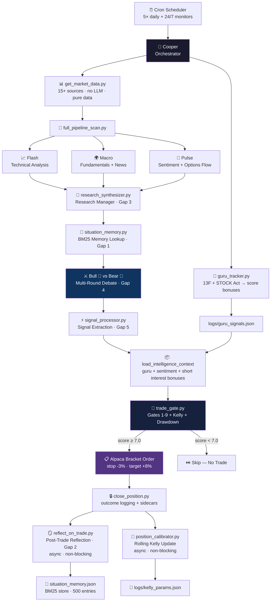
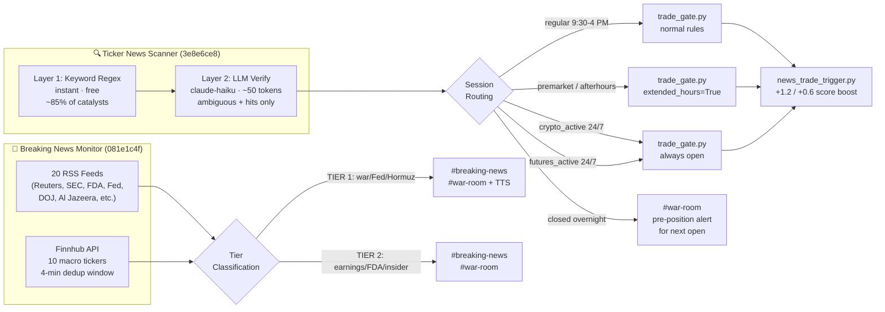
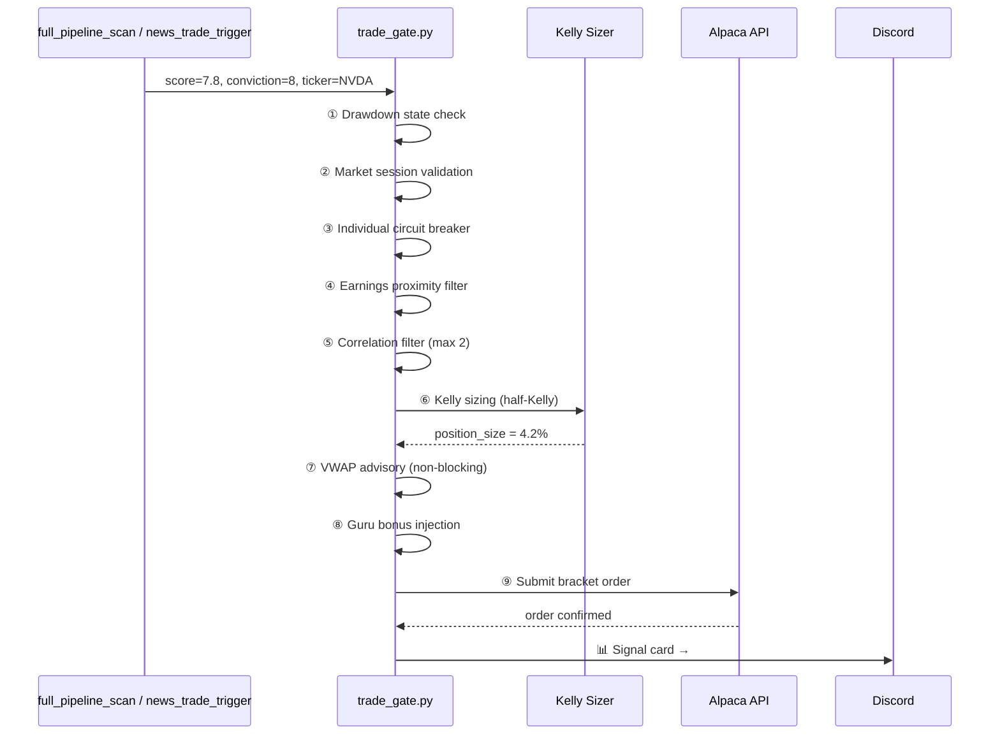

# 🦅 ProTrader — Autonomous Multi-Agent Trading System

> **Target:** $1,000,000 from $100,499 | Paper trading via Alpaca | Zero manual steps | Built on OpenClaw

[](https://github.com/oabdelmaksoud/protrader)
[](https://python.org)
[](https://github.com/oabdelmaksoud/protrader)
[](https://github.com/oabdelmaksoud/protrader)
[](LICENSE)

---

## What Is This?

ProTrader is a **fully autonomous trading system** that runs 24/7 on a Mac. It:

- 🔍 **Scans markets 5× per day** using 7 specialized AI agents in parallel
- 📡 **Monitors breaking news every 2 minutes** — both macro events and stock-specific catalysts
- 🧠 **Debates every trade** using a Bull vs Bear multi-round argument engine
- 🚦 **Gates every entry** through 9 risk checkpoints before touching Alpaca
- 📊 **Posts real-time signals** to Discord with standardized signal cards
- 🔄 **Learns from every trade** via post-trade LLM reflection and BM25 memory
- 👥 **Serves private member channels** — personal trade alerts, portfolio analysis, live quotes

No separate LLM API keys needed. All inference runs through OpenClaw's native model routing.

---

## Architecture

### Full Trading Pipeline



---

### Real-Time News Pipeline (runs in parallel, every 2 min)



---

### Trade Gate Sequence



---

### Intelligence Score Composition

```mermaid
graph TD
    BASE["Base Score\nFlash + Macro + Pulse\n0–10 scale"] --> DEBATE["Bull vs Bear Debate\n±adjustment"]
    DEBATE --> INTEL["Intelligence Bonuses"]

    G["🧠 Guru Signal\nPelosi: +0.9\nDruckenmiller: +0.9\nTepper/Burry: +0.8\nBuffett/Ackman: +0.7\nCongressional: +0.4"]
    SE["💬 Sentiment\nbullish >0.5: +0.3\nbearish <-0.5: -0.3"]
    SH["📉 Short Interest\nfloat >20%: +0.5"]
    NW["📰 News Catalyst\nCATALYST_A: +1.2\nCATALYST_B: +0.6"]

    G --> INTEL
    SE --> INTEL
    SH --> INTEL
    NW --> INTEL

    INTEL --> FINAL["Final Score\ncapped at 10.0"]

    FINAL -->|"≥7.0 (9:30–1 PM)"| ENTER["✅ Enter Trade"]
    FINAL -->|"≥7.5 (1–2:30 PM)"| ENTER
    FINAL -->|"< threshold"| PASS["⏭️ Pass"]

    style ENTER fill:#27ae60,color:#fff
    style PASS fill:#e74c3c,color:#fff
```



---

### System Monitor Schedule

```mermaid
gantt
    title ProTrader Daily Schedule (ET)
    dateFormat HH:mm
    axisFormat %H:%M

    section 24/7
    Breaking News Monitor    :active, 00:00, 24:00
    Ticker News Scanner      :active, 00:00, 24:00
    Whale Tracker            :crit,   00:00, 24:00

    section Pre-Market
    Guru Tracker             :done,   06:00, 06:30
    FOMC + Sentiment         :done,   08:00, 08:30
    War Room Brief (Mon)     :done,   08:45, 09:00
    Circuit Breaker Reset    :done,   09:25, 09:30

    section Market Hours
    9:30 AM Scan             :active, 09:30, 10:00
    10:30 AM Scan            :active, 10:30, 11:00
    12:00 PM Scan            :active, 12:00, 12:30
    1:00 PM Scan             :active, 13:00, 13:30
    2:30 PM Final Window     :crit,   14:30, 15:00
    Dark Pool Monitor        :active, 09:30, 16:00
    Drawdown Circuit Breaker :active, 09:30, 16:00

    section After-Hours
    Earnings Calendar        :done,   16:00, 16:30
    Market Close P&L         :done,   16:05, 16:15
    After-Hours Earnings     :done,   16:00, 20:00
```



---

## Agent Roster

| Agent | Model | Role | When Active |
|-------|-------|------|-------------|
| Flash 📈 | claude-sonnet-4-6 | Technical analysis — price action, MACD, BB, VWAP | Every scan |
| Macro 🌍 | claude-sonnet-4-6 | Fundamentals, news, economic calendar | Every scan |
| Pulse 💬 | claude-sonnet-4-6 | Sentiment, options flow, dark pool | Every scan |
| Bull 🐂 | claude-opus-4-6 | Bullish researcher — debate round 1 | Debate phase |
| Bear 🐻 | claude-opus-4-6 | Bearish researcher — debate round 1 | Debate phase |
| Risk 🛡️ | claude-sonnet-4-6 | Position sizing, correlation, drawdown | Gate phase |
| Executor ⚡ | claude-sonnet-4-6 | Bracket orders, position monitoring, EOD close | Execution |

---

## Real-Time News Intelligence

### Two parallel monitors (both run every 2 minutes)

#### 1. Breaking News Monitor — Macro & Geopolitical
Watches 20 RSS feeds + Finnhub API. Posts immediately on TIER 1/2 events.

| Tier | Triggers | Action |
|------|----------|--------|
| TIER 1 | War, Fed emergency, Hormuz closure, regime collapse | #breaking-news + #war-room + TTS voice alert |
| TIER 2 | Earnings surprise, M&A, FDA decision, congressional buy | #breaking-news + #war-room |
| Silent | Nothing actionable | No post (never spams) |

#### 2. Ticker News Scanner — Stock-Specific Catalysts
Watches 20 watchlist tickers via Finnhub company-news API. Uses a 2-layer system:

**Layer 1: Keyword Regex** (instant, free, ~85% accuracy)
| Catalyst | Examples | Score Boost |
|----------|----------|-------------|
| CATALYST_A | EPS beat/miss, M&A, FDA approval, fraud, CEO departure | +1.2 |
| CATALYST_B | Analyst upgrade/downgrade, partnership, product launch, index add | +0.6 |
| CATALYST_C | Analyst note, price target, conference | logged only |
| AMBIGUOUS | Mixed results, guidance, strategic review | → Layer 2 |

**Layer 2: LLM Verification** (claude-haiku, ~50 tokens, fires only on hits + ambiguous)
- Confirms BULLISH / BEARISH / NEUTRAL
- Confirms MAJOR / MINOR / NONE impact
- Can promote AMBIGUOUS → CATALYST_A/B or downgrade to neutral
- Cost: ~5–15 calls/day = ~1,000 tokens (~93% cheaper than classifying all headlines)

**Session-Aware Routing:**
| Session | Hours | What Happens |
|---------|-------|--------------|
| Regular | 9:30 AM–4:00 PM ET | Trade executes normally |
| Pre-market | 4:00 AM–9:30 AM ET | Alpaca `extended_hours=True`, spread warning |
| After-hours | 4:00 PM–8:00 PM ET | Alpaca `extended_hours=True`, volume warning |
| Crypto active | 24/7 | MSTR, COIN, RIOT, MARA always trigger |
| Futures active | Sun 6PM–Fri 5PM ET | ES, NQ, CL, GC always trigger |
| Closed | Overnight/weekend | Pre-position alert to #war-room for next open |

---

## Data Sources (15+)

| Source | Data |
|--------|------|
| Alpaca IEX WebSocket | Real-time quotes (primary feed) |
| Finnhub API | News, earnings, options chain, company-news |
| Alpha Vantage | MACD, Bollinger Bands |
| Polygon.io | Options flow, tick data |
| yfinance | Sector ETFs, futures, pre-market gaps |
| SEC EDGAR | 13F filings, Form 4 insider trades |
| OpenInsider RSS | Insider cluster buys |
| House/Senate Stock Watcher | STOCK Act political disclosures |
| Finviz | Short interest (FINRA bi-weekly) |
| GuruFocus RSS | Guru news signals |
| NY Fed | SOFR/EFFR liquidity stress |
| Earnings Whisper | EPS whisper vs. consensus |
| SpotGamma | GEX (gamma exposure) levels |
| 20 RSS Feeds | Reuters, Al Jazeera, SEC, FDA, Fed, DOJ, etc. |

---

## Guru Tracker

Monitors 10 hedge fund managers + 5 politicians via 13F filings, STOCK Act disclosures, and GuruFocus RSS.

### Tracked Managers
| Manager | Fund | Alpha Score |
|---------|------|-------------|
| Druckenmiller | Duquesne | 0.9 — copy immediately |
| Tepper | Appaloosa | 0.8 |
| Burry | Scion Capital | 0.8 |
| Buffett | Berkshire Hathaway | 0.7 |
| Ackman | Pershing Square | 0.75 |
| Cohen | Point72 | 0.7 |
| Dalio | Bridgewater | 0.6 |
| Halvorsen | Viking Global | 0.7 |
| Loeb | Third Point | 0.65 |
| Coleman | Tiger Global | 0.65 |

### Tracked Politicians
| Name | Chamber | Alpha Score | Edge |
|------|---------|-------------|------|
| Nancy Pelosi | House | 0.95 | Tech options — copy immediately |
| Tommy Tuberville | Senate | 0.7 | Financials/energy |
| Dan Crenshaw | House | 0.65 | Defense (LMT/RTX/NOC) |
| Rand Paul | Senate | 0.6 | Pharma shorts |

---

## Trade Execution Rules

### Entry Thresholds
| Window | Min Score | Min Conviction | Notes |
|--------|-----------|----------------|-------|
| 9:30 AM – 1:00 PM | 7.0 | 7 | Standard window |
| 1:00 PM – 2:30 PM | 7.5 | 8 | Raised bar |
| After 2:30 PM | ❌ | — | No new entries |
| Extended hours | 7.5 | 8 | Wider spreads = higher bar |
| News-triggered (TIER 1) | 6.5 | 7 | Catalyst boost applied first |

### Risk Management
- **Stop loss:** -3% trailing | **Take profit:** +8%
- **Max open positions:** 2
- **Kelly sizing:** half-Kelly from rolling 30-trade win rate (floor: 1%)
- **Partial exit:** 50% at +5%, let rest run to +8%
- **Drawdown halt:** portfolio down 5%+ → no new entries
- **Guru bonus:** injected before gate check, can push marginal score over threshold

---

## Framework Gap Closures

ProTrader closes 5 gaps vs. the upstream [TauricResearch/TradingAgents](https://github.com/TauricResearch/TradingAgents) framework:

| # | Gap | File | Description |
|---|-----|------|-------------|
| 1 | Persistent Memory | `tradingagents/memory/situation_memory.py` | BM25 retrieval over JSON store (500 entries) |
| 2 | Post-Trade Reflection | `scripts/reflect_on_trade.py` | LLM reflects on each close, updates memory |
| 3 | Research Synthesis | `tradingagents/agents/managers/research_synthesizer.py` | Synthesizes Flash+Macro+Pulse before debate |
| 4 | Multi-Round Debate | `tradingagents/graph/debate_engine.py` | Bull and Bear argue 2 rounds before signal |
| 5 | Signal Processing | `tradingagents/graph/signal_processor.py` | Standardized extraction + Discord card format |

---

## Private Member Channels

Each server member gets a private `#{username}-trades` channel with:
- 🔔 **Personal trade alerts** when Cooper enters a position on their watchlist tickers
- 💰 **Live quotes** fetched fresh before every response (never stale/cached)
- 📊 **Portfolio analysis** with rebalancing suggestions
- 🌊 **Whale alerts** — congressional buys, insider trades matching their tickers

### Setup Commands
Message your private channel:
```
watchlist: NVDA, AAPL, MSFT    → sets tickers to watch for alerts
risk: moderate                  → conservative / moderate / aggressive sizing
```

---

## Dashboard

Real-time SSE dashboard at `http://localhost:8002` — starts automatically at 9:20 AM.

| Page | Content |
|------|---------|
| Portfolio | P&L, open positions, bracket order status, equity curve |
| Signals | Live signal cards with ASCII price charts |
| Options | Multi-strategy engine (9 strategies, 3 tabs) |
| Intelligence | Guru signals, whale activity, sentiment scores, short interest |
| Backtest | Historical performance, win rate by ticker/time/catalyst |

---

## Quick Start

### Prerequisites
```bash
pip install -r requirements.txt
```

### Environment (`.env`)
```env
# Required
ALPACA_API_KEY=your_key
ALPACA_SECRET_KEY=your_secret
ALPACA_BASE_URL=https://paper-api.alpaca.markets

# Data sources
FINNHUB_API_KEY=your_key
ALPHA_VANTAGE_KEY=your_key
POLYGON_API_KEY=your_key
NEWS_API_KEY=your_key
```

### Usage Examples

```bash
# Get live quotes (always use before answering market questions)
python3 scripts/quick_quote.py NVDA MSFT AAPL

# Run full pipeline scan on a ticker
python3 scripts/full_pipeline_scan.py --ticker NVDA --rounds 2

# Manual trade gate test
python3 scripts/trade_gate.py \
  --ticker NVDA --action BUY \
  --score 7.8 --conviction 8 \
  --analysis "Strong breakout above VWAP on high volume" \
  --scan-time "9:30"

# Run ticker news scanner manually
python3 scripts/ticker_news_scanner.py

# Check account status
python3 scripts/account_status.py

# Start dashboard
python3 dashboard/server.py  # → http://localhost:8002
```

---

## System Rules (Inviolable)

1. **Market moves NEVER generate Discord posts** — only fresh news headlines trigger posts
2. **No web searches from the market moves path** in breaking news monitor
3. **`openclaw oracle` does not exist** — use `claude --print --model <model>`
4. **All scripts:** `REPO = Path(__file__).resolve().parent.parent` before `sys.path.insert`
5. **Graceful degradation** — every API call wrapped in try/except, system never crashes
6. **SQLite only** — `sqlite3` stdlib, no new DB dependencies
7. **Dedup TTL = 4h** — Iran/war suppressors refresh every 3h automatically
8. **Reflection is async** — `Popen`, not `run` — never blocks position close
9. **Guru bonus injects before gate** — can legitimately push marginal score over threshold
10. **Live data always** — never answer market questions from training knowledge
11. **Member data sealed** — private channel data never referenced in any shared channel
12. **Session-aware routing** — regular/premarket/afterhours/crypto/futures/closed
13. **Overnight alerts** — catalysts during closed hours post as pre-position alerts, never silently dropped

---

## $1M Math

| Metric | Value |
|--------|-------|
| Starting capital | $100,394 |
| Target | $1,000,000 |
| Average win | 12% |
| Win rate | 65% |
| Avg trades/day | 1–2 |
| Trading days/year | 250 |
| Estimated timeline | **< 2 years** |

---

## Built On

- [OpenClaw](https://openclaw.ai) — agent orchestration, cron scheduling, Discord integration
- [TauricResearch/TradingAgents](https://github.com/TauricResearch/TradingAgents) — base framework (5 gaps closed)
- [Alpaca Markets](https://alpaca.markets) — paper + live trade execution
- [Finnhub](https://finnhub.io) — real-time financial data

---

*🦅 Cooper | ProTrader | Last updated: 2026-03-01*
