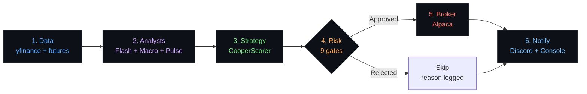

# Pro-Trader — Autonomous Trading on Autopilot

> **AI-powered analysis. Plugin architecture. One command to trade.**
>
> 3 AI analysts run in parallel. 9 risk gates protect your capital. 12 plugins you can swap, extend, or replace.

[](https://python.org)
[](https://github.com/oabdelmaksoud/Pro-Trader-SKILL)
[](#)
[](LICENSE)

```python
from pro_trader import ProTrader

trader = ProTrader()
signal = trader.analyze("NVDA")           # Full AI analysis in one call
signals = trader.scan(["NVDA", "SPY"])    # Scan your whole watchlist
trader.plugins.disable("discord")         # Toggle any plugin at runtime
```

---

## Why Pro-Trader?

Most trading bots are monolithic scripts — one data source, one strategy, hardcoded rules. When something breaks, everything breaks.

**Pro-Trader is different.** Every capability is a plugin:

- **Swap your data source** without touching your strategy
- **Add a new analyst** without rewriting the pipeline
- **Disable risk gates** for backtesting, re-enable for live
- **Build your own plugins** with a simple Python interface
- **Never crash** — every step has fallback behavior

```
┌─────────────────────────────────────────────────────────────┐
│                     YOUR TRADING SYSTEM                      │
│                                                              │
│   Data           Analysts        Strategy        Execution   │
│   ┌─────────┐   ┌──────────┐   ┌───────────┐   ┌────────┐ │
│   │ yfinance│   │ Flash    │   │ Cooper    │   │ Alpaca │ │
│   │ futures │   │ Macro    │   │ Scorer    │   │ Paper  │ │
│   │ YOUR    │   │ Pulse    │   │ YOUR      │   │ YOUR   │ │
│   │ PLUGIN  │   │ YOUR     │   │ PLUGIN    │   │ PLUGIN │ │
│   └─────────┘   └──────────┘   └───────────┘   └────────┘ │
│                                                              │
│   Risk            Monitors        Notifiers                  │
│   ┌─────────┐   ┌──────────┐   ┌───────────┐              │
│   │ Circuit │   │ News     │   │ Discord   │              │
│   │ Breaker │   │ FOMC     │   │ Console   │              │
│   │ YOUR    │   │ Futures  │   │ YOUR      │              │
│   │ PLUGIN  │   │ YOUR     │   │ PLUGIN    │              │
│   └─────────┘   └──────────┘   └───────────┘              │
└─────────────────────────────────────────────────────────────┘
```

---

## Get Started in 60 Seconds

```bash
pip install "pro-trader[all]"
pro-trader setup                  # Interactive wizard
pro-trader analyze NVDA           # Your first analysis
```

### Install Options

```bash
pip install pro-trader             # Core only (data + scoring)
pip install "pro-trader[agents]"   # + AI analysts (Claude, GPT, Gemini)
pip install "pro-trader[all]"      # Everything (analysts + broker + monitors + Discord)
```

### From Source

```bash
git clone https://github.com/oabdelmaksoud/Pro-Trader-SKILL.git
cd Pro-Trader-SKILL
pip install -e ".[all]"
```

---

## The Pipeline

Every ticker goes through a 6-step pipeline. Each step is a plugin you control.



| Step | What happens | Plugins |
|------|-------------|---------|
| **Data** | Fetch quotes, technicals, fundamentals, news | `yfinance`, `futures` |
| **Analysts** | 3 AI agents analyze in parallel | `flash` (technical), `macro` (fundamental), `pulse` (sentiment) |
| **Strategy** | Score the signal 0-10 | `cooper_scorer` |
| **Risk** | 9 safety gates check before execution | `circuit_breaker` (drawdown halt, Kelly sizing, correlation) |
| **Broker** | Submit bracket order with stop-loss + take-profit | `alpaca` (paper or live) |
| **Notify** | Send rich signal cards | `discord`, `console` |

---

## CLI

```bash
pro-trader analyze NVDA           # Analyze a single stock
pro-trader analyze /METH26        # Analyze micro futures
pro-trader scan --watchlist        # Scan your full watchlist
pro-trader plugin list             # See all loaded plugins
pro-trader plugin health           # Check what's working
pro-trader monitor check           # Run background monitors
pro-trader setup                   # Setup wizard (install, update, uninstall)
pro-trader health                  # Full system health check
```

---

## Python API

```python
from pro_trader import ProTrader

# Initialize with your settings
trader = ProTrader(config={
    "llm_provider": "anthropic",
    "score_threshold": 7.0,
})

# Analyze a single ticker
signal = trader.analyze("NVDA", dry_run=True)
print(f"{signal.ticker}: {signal.direction.value} — score {signal.score}/10")

# Scan multiple tickers at once
signals = trader.scan(["NVDA", "SPY", "/METH26", "/M6EH26"])
for s in signals:
    if s.meets_threshold:
        print(f"  TRADE: {s.ticker} {s.direction.value} — {s.score:.1f}/10")

# Runtime plugin control
trader.plugins.disable("discord")      # Quiet mode
trader.plugins.enable("discord")       # Back on

# React to events in real-time
trader.on("signal.new", lambda s: print(f"New signal: {s.ticker}"))
trader.on("order.filled", lambda o, r: print(f"Filled: {r.order_id}"))
trader.on("risk.halt", lambda: print("Circuit breaker tripped!"))
```

---

## 3 AI Analysts Working Together

Every analysis runs three specialized AI agents **in parallel**, then combines their perspectives:

| Agent | Focus | What it looks at |
|-------|-------|-----------------|
| **Flash** | Technical | MACD, Bollinger Bands, RSI, VWAP, volume, support/resistance |
| **Macro** | Fundamental | Earnings, revenue, news catalysts, economic calendar, sector rotation |
| **Pulse** | Sentiment | Options flow, social sentiment, insider trades, institutional positioning |

Their reports feed into the **CooperScorer**, which produces a composite score from 0-10. Signals scoring 7+ with high confidence trigger trade execution.

---

## Built-in Risk Protection

Your capital is protected by multiple safety gates that run on every signal:

| Gate | What it does |
|------|-------------|
| **Score threshold** | Only trades scoring 7.0+ with confidence 7/10+ |
| **Trailing stop loss** | Automatic -3% trailing stop on every position |
| **Take profit** | Auto-exit at +8%, partial exit (50%) at +5% |
| **Drawdown halt** | Stops all trading when portfolio drops 5% |
| **Kelly sizing** | Half-Kelly position sizing from rolling win rate |
| **Correlation filter** | Prevents overconcentration in correlated assets |
| **Futures margin cap** | Never uses more than 60% of account for margin |
| **Earnings guard** | Reduces position size around earnings dates |
| **Daily loss limit** | Stops trading after hitting daily loss threshold |

---

## Futures Support

13 micro futures contracts with automatic margin calculation and session-aware trading:

| Contract | Asset Class | Contract | Asset Class |
|----------|-------------|----------|-------------|
| `/MET` Micro Ether | Crypto | `/MES` Micro S&P 500 | Index |
| `/MCD` Micro CAD | FX | `/MNQ` Micro Nasdaq | Index |
| `/M6A` Micro AUD | FX | `/MYM` Micro Dow | Index |
| `/M6B` Micro GBP | FX | `/MCL` Micro Crude | Commodity |
| `/M6E` Micro EUR | FX | `/MNG` Micro NatGas | Commodity |
| `/MSF` Micro CHF | FX | `/1OZ` 1oz Gold | Commodity |
| `/BFF` Bitcoin Friday | Crypto | | |

Pro-Trader automatically filters contracts based on your account size — you'll only see futures you can actually afford to trade.

---

## Extend with Your Own Plugins

Write a plugin in minutes. Implement one interface, register it, done.

```python
from pro_trader.core.interfaces import AnalystPlugin

class MyAnalyst(AnalystPlugin):
    name = "my_analyst"
    version = "1.0.0"

    def analyze(self, data, context=None):
        # Your analysis logic here
        return {"direction": "buy", "confidence": 8, "reasoning": "..."}

trader = ProTrader()
trader.register(MyAnalyst())
```

Or publish as a package with auto-discovery:

```toml
# In your package's pyproject.toml
[project.entry-points."pro_trader.analysts"]
my_analyst = "my_package:MyAnalyst"
```

### 7 Plugin Interfaces

| Interface | What you build | Entry Point |
|-----------|---------------|-------------|
| `DataPlugin` | Custom data sources (Polygon, IEX, etc.) | `pro_trader.data` |
| `AnalystPlugin` | Your own analysis agents | `pro_trader.analysts` |
| `StrategyPlugin` | Custom scoring / signal logic | `pro_trader.strategies` |
| `BrokerPlugin` | New broker integrations (IBKR, Schwab, etc.) | `pro_trader.brokers` |
| `RiskPlugin` | Additional risk gates | `pro_trader.risk` |
| `MonitorPlugin` | Background alert systems | `pro_trader.monitors` |
| `NotifierPlugin` | Slack, Telegram, email, etc. | `pro_trader.notifiers` |

---

## Event System

Plugins don't import each other — they communicate through events:

```python
trader.on("signal.new", my_logger)           # New signal scored
trader.on("signal.approved", my_tracker)     # Passed all risk gates
trader.on("signal.rejected", my_debugger)    # Blocked by risk
trader.on("order.filled", my_notifier)       # Trade executed
trader.on("monitor.alert", my_escalator)     # Breaking news / FOMC / etc.
trader.on("risk.halt", my_panic_handler)     # Circuit breaker tripped
```

---

## Configuration

Settings cascade — later sources override earlier ones:

```
Defaults → Config files → Environment variables → CLI flags
```

### Quick Config

```env
# .env file
ALPACA_API_KEY=your_key
ALPACA_SECRET_KEY=your_secret
ANTHROPIC_API_KEY=your_key
PROTRADER_SCORE_THRESHOLD=7.0
```

### Full Config (`config/strategy.json`)

```json
{
  "watchlist": {
    "equities": ["NVDA", "AAPL", "SPY", "MSFT"],
    "futures": ["/MET", "/MCD", "/M6A", "/MES"]
  },
  "score_threshold": 7.0,
  "futures_position": {
    "max_contracts": 1,
    "max_margin_pct": 0.60
  }
}
```

---

## Discord Alerts via OpenClaw

Get real-time signal cards in Discord through [OpenClaw](https://github.com/openclaw/openclaw):

```python
from pro_trader.services.openclaw import send_discord

send_discord("your_channel_id", "BUY NVDA — Score 8.5/10, High Confidence")
```

Works with OpenClaw v2026.3.x. If OpenClaw isn't installed, notifications silently skip — **nothing breaks**.

---

## Project Structure

```
pro_trader/
├── core/               # Interfaces, registry, pipeline, config, event bus
├── models/             # Signal, MarketData, Quote, Position, Order
├── plugins/            # 12 built-in plugins across 7 categories
│   ├── data/           # yfinance, futures
│   ├── analysts/       # flash, macro, pulse
│   ├── strategies/     # cooper_scorer
│   ├── brokers/        # alpaca
│   ├── risk/           # circuit_breaker
│   ├── monitors/       # news, fomc, futures_monitor
│   └── notifiers/      # discord, console
├── services/           # OpenClaw integration
└── cli/                # CLI app + setup wizard

tests/                  # 162 tests
config/                 # Strategy + watchlist config
scripts/                # Cron helpers + operational scripts
```

---

## Development

```bash
pip install -e ".[dev]"
pytest                       # 162 tests
ruff check .                 # Lint
pro-trader plugin health     # Integration check
```

---

## Built On

| Project | Role |
|---------|------|
| [TauricResearch/TradingAgents](https://github.com/TauricResearch/TradingAgents) | Base multi-agent framework (5 gap closures applied) |
| [OpenClaw](https://github.com/openclaw/openclaw) | Discord messaging bridge |
| [Alpaca Markets](https://alpaca.markets) | Paper + live trade execution |
| [yfinance](https://github.com/ranaroussi/yfinance) | Market data |
| [LangGraph](https://github.com/langchain-ai/langgraph) | AI agent orchestration |

---

<p align="center">
  <b>Pro-Trader v1.1.0</b> — Stop writing trading scripts. Start building trading systems.
</p>
