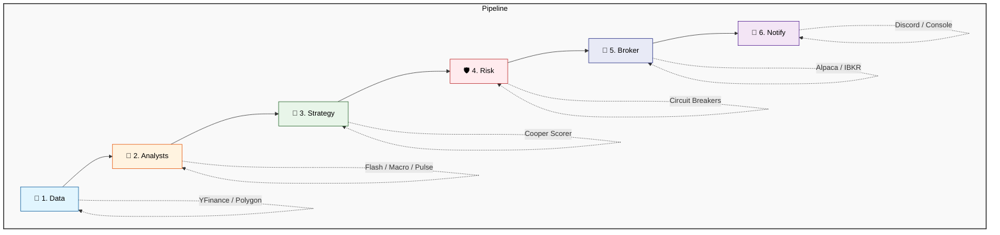

<div align="center">

# 📈 Pro-Trader

**A plugin-based, autonomous trading framework for Python.**

[](https://www.python.org/downloads/)
[](https://opensource.org/licenses/MIT)
[](https://github.com/openclaw/openclaw)

*Analyze stocks and futures, score trade signals, and execute through your broker — all from a simple API or CLI.*

</div>

---

## 🚀 Quick Start

### Installation

Install the core components or full suite based on your needs:

```bash
# Core framework (data fetching + scoring pipeline)
pip install pro-trader

# Include AI analysts (LangGraph + LLMs)
pip install "pro-trader[agents]"

# Install everything (Broker, Dashboard, Monitors)
pip install "pro-trader[all]"

# Install from source
git clone https://github.com/oabdelmaksoud/Pro-Trader-SKILL.git
cd Pro-Trader-SKILL
pip install -e ".[all]"
```

### Basic Usage

You can use the rich terminal CLI or the Python API:

**CLI:**
```bash
pro-trader analyze NVDA           # Analyze a stock
pro-trader analyze /METH26        # Analyze a futures contract
pro-trader scan --watchlist       # Scan your entire watchlist
pro-trader plugin list            # Show loaded plugins
pro-trader health                 # Check system health
pro-trader setup                  # Interactive setup wizard
```

**Python API:**
```python
from pro_trader import ProTrader

trader = ProTrader()

# Analyze a single asset
signal = trader.analyze("NVDA")
print(f"{signal.ticker}: {signal.direction.value} score={signal.score}")

# Scan multiple assets
signals = trader.scan(["NVDA", "SPY", "AAPL"])
```

---

## 🏗️ Architecture Pipeline

Pro-Trader evaluates every ticker through a robust, 6-step pipeline. Each step is powered by swappable **plugins**.



1. **Data:** Fetch live quotes, technical indicators, and news.
2. **Analysts:** AI agents evaluate the data in parallel (e.g., Flash, Macro, Pulse).
3. **Strategy:** A composite score (0-10) is generated based on the analysts' reports.
4. **Risk:** Enforces risk gates (drawdown limits, sizing, account margin).
5. **Broker:** Executes the trade if all criteria and risk gates are met.
6. **Notify:** Sends alerts via Discord or the console.

---

## 🔌 Plugin System

Everything in Pro-Trader is a plugin. It ships with **12 built-in plugins** across 7 categories:

| Category | Built-in Plugins | Description |
|----------|-----------------|-------------|
| 📡 **Data** | `yfinance`, `futures` | Fetch quotes, technicals, and fundamentals. |
| 🧠 **Analysts** | `flash`, `macro`, `pulse` | AI-powered technical, fundamental, and sentiment check. |
| 🎯 **Strategy** | `cooper_scorer` | Composite scoring with configurable thresholds. |
| 🛡️ **Risk** | `circuit_breaker` | Drawdown halts and daily loss limits. |
| 👁️ **Monitors** | `news`, `fomc`, `futures_monitor` | Background alerts for breaking news, FOMC dates, and sessions. |
| 🏦 **Broker** | `alpaca` | Paper and live trading via Alpaca Markets. |
| 🔔 **Notifiers** | `discord`, `console` | Send formatted signal cards to Discord or the terminal. |

### Building Your Own Plugin

It's easy to build and register custom plugins:

```python
from pro_trader.core.interfaces import DataPlugin
from pro_trader.models.market_data import Quote

class MyDataPlugin(DataPlugin):
    name = "my_source"
    version = "1.0.0"

    def get_quote(self, symbol):
        return Quote(symbol=symbol, price=100.0, source="my_source")

    def get_technicals(self, symbol, period="3mo"):
        return None

# Register it directly
trader = ProTrader()
trader.register(MyDataPlugin())
```

*Alternatively, register it via `pyproject.toml` for automatic discovery.*

---

## ⚙️ Configuration

Pro-Trader leverages a cascading configuration system, processing settings in the following order (last wins):

1. **Built-in Defaults:** Base system settings.
2. **Config Files:** `config/*.yaml` or `config/*.json` 
3. **Environment variables:** E.g., `PROTRADER_SCORE_THRESHOLD=7.0`
4. **CLI Flags / kwargs:** Immediate overrides passed via code or terminal.

### Essential Environment Variables

```env
# Broker Integration (Alpaca)
ALPACA_API_KEY=your_key
ALPACA_SECRET_KEY=your_secret
ALPACA_BASE_URL=https://paper-api.alpaca.markets

# AI Analyst Providers
ANTHROPIC_API_KEY=your_key

# Pro-Trader Overrides
PROTRADER_LLM_PROVIDER=anthropic
PROTRADER_SCORE_THRESHOLD=7.0
```

---

## 📊 Futures Support

Pro-Trader seamlessly handles **micro futures contracts**, with automatic proxy ticker resolution, margin calculation, and account affordability filtering.

| Future | Asset Class | Future | Asset Class |
|--------|-------------|--------|-------------|
| `/MET` | Crypto (Micro Ether) | `/BFF` | Crypto (Bitcoin Friday) |
| `/MCD` | FX (Micro CAD) | `/1OZ` | Commodity (1oz Gold) |
| `/M6A` | FX (Micro AUD) | `/MNG` | Commodity (Micro NatGas) |
| `/M6B` | FX (Micro GBP) | `/MES` | Index (Micro S&P 500) |
| `/M6E` | FX (Micro EUR) | `/MNQ` | Index (Micro Nasdaq) |
| `/MSF` | FX (Micro CHF) | `/MYM` | Index (Micro Dow) |
| `/MCL` | Commodity (Micro Crude) | | |

---

## 🛡️ Risk Management Defaults

| Rule Area | Default Behavior |
|-----------|------------------|
| **Entry Threshold** | Min Score `7.0/10` |
| **Stop Loss** | `-3%` Trailing Stop |
| **Take Profit** | `+8%` Static |
| **Partial Exit** | Scale out `50%` position at `+5%` profit |
| **Circuit Breaker** | Halt trading if portfolio drawdown is `>= 5%` |
| **Position Sizing** | Kelly criterion (Half-Kelly based on rolling win rate) |
| **Futures Cap** | Max `60%` of account margin allocation |

---

## 💬 OpenClaw Integration

Pro-Trader uses [OpenClaw](https://github.com/openclaw/openclaw) as its exclusive Discord messaging bridge. It integrates seamlessly without direct Discord bot tokens.

```python
from pro_trader.services.openclaw import send_discord

# Directly send messages to Discord via OpenClaw
send_discord("your_channel_id", "🚨 Signal: BUY NVDA score 8.5")
```

*Note: If OpenClaw is not installed, Pro-Trader gracefully degrades and will skip Discord notifications.*

---

## 📁 Repository Structure

```text
pro_trader/
├── core/               # Framework internals: interfaces, registry, pipeline
├── models/             # Standardized datatypes: Signal, MarketData, Position
├── plugins/            # 12 internal plugins categorized by pipeline stage
├── services/           # External service bridges (e.g. OpenClaw)
└── cli/                # Command-line interface and configuration tools

tradingagents/          # Legacy multi-agent system (preserved for compatibility)
config/                 # YAML and JSON configurations
scripts/                # Operational and cron helper scripts
tests/                  # Robust pytest suite (>160 tests)
```

---

## 🤝 Built On

- **[TauricResearch/TradingAgents](https://github.com/TauricResearch/TradingAgents)** — Base multi-agent framework
- **[OpenClaw](https://github.com/openclaw/openclaw)** — Discord messaging bridge
- **[Alpaca Markets](https://alpaca.markets)** — Broker trade execution
- **[yfinance](https://github.com/ranaroussi/yfinance)** — Market data provider

<p align="center">
  <i>Pro-Trader v1.1.0</i>
</p>
