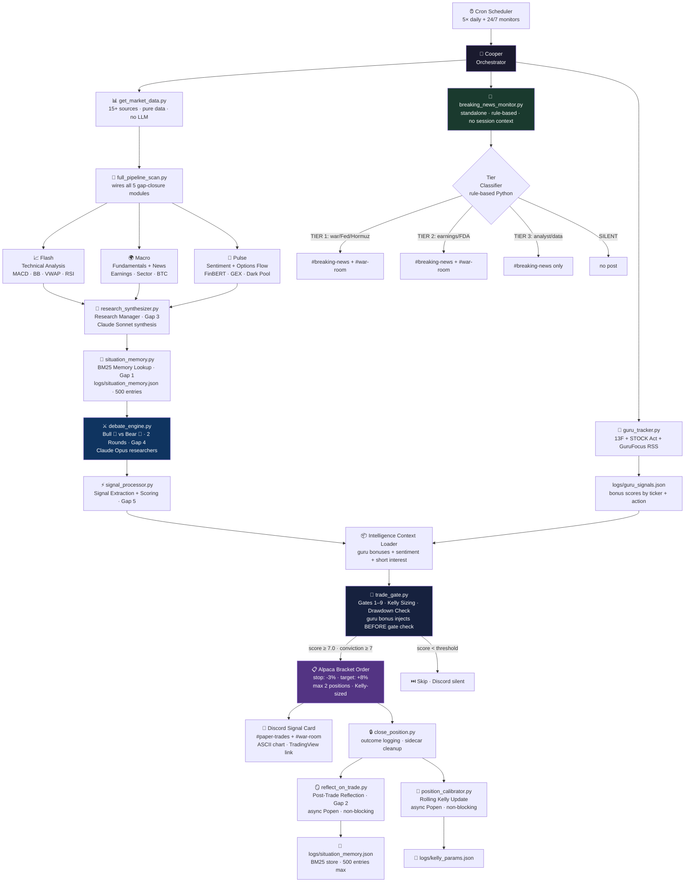
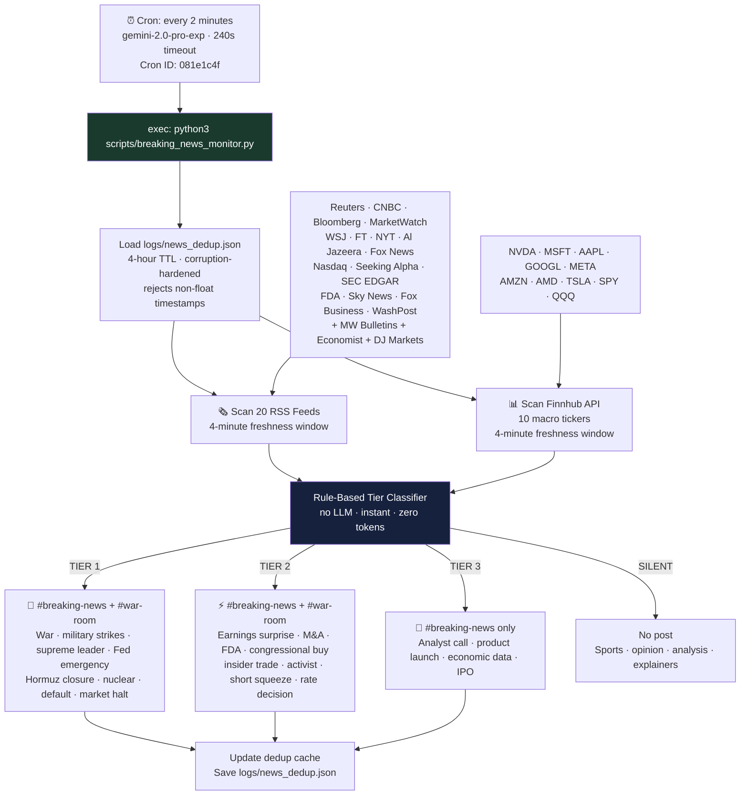
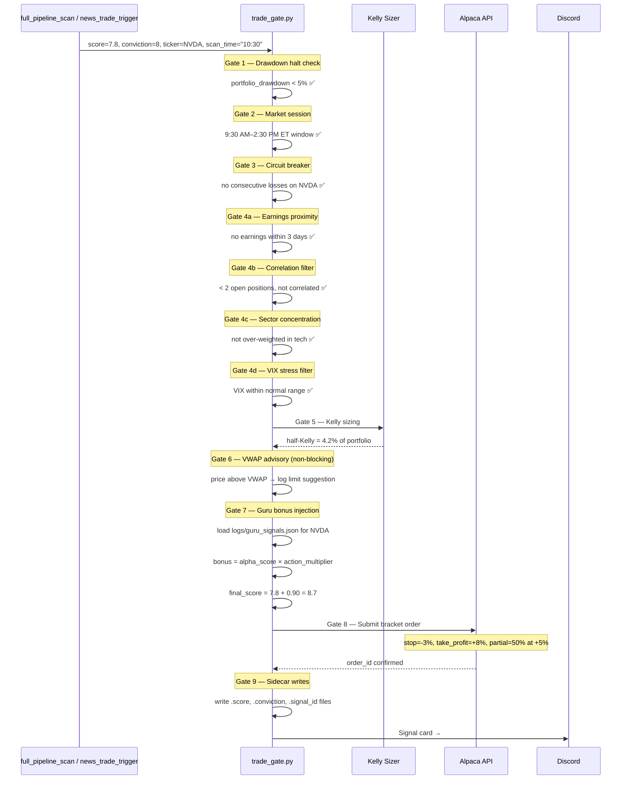
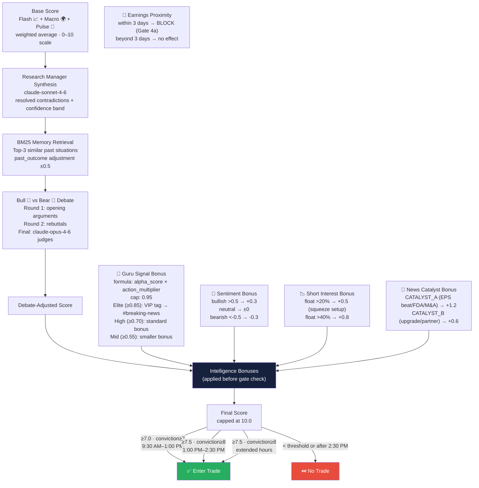
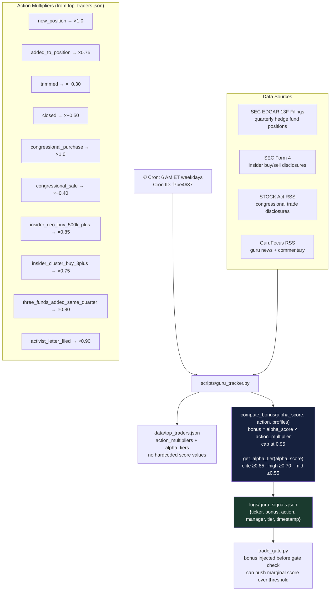
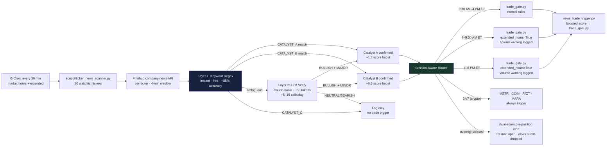
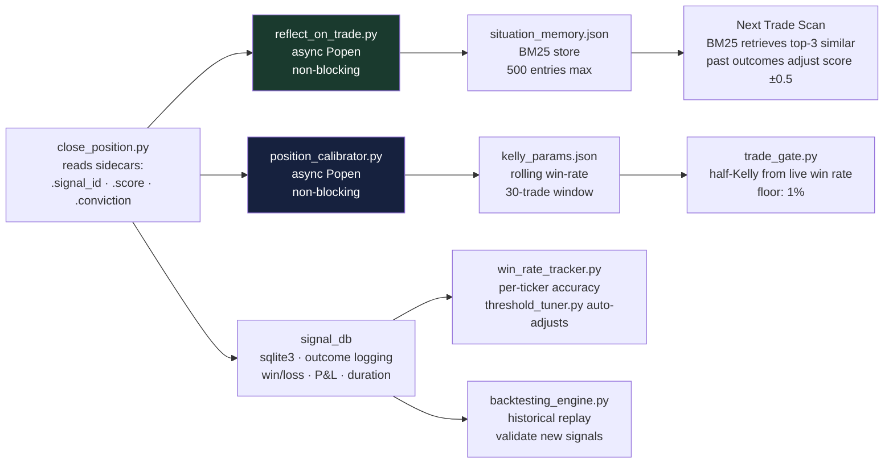
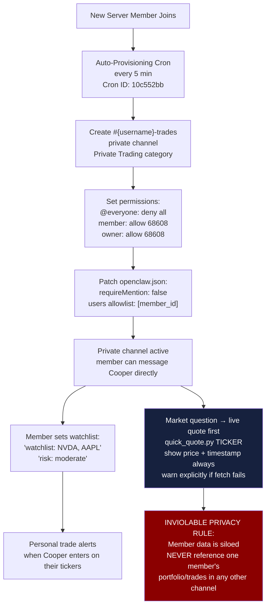

# 🦅 ProTrader — Autonomous Multi-Agent Trading System

> **Target:** $1,000,000 from $100,499 · Paper trading via Alpaca · Zero manual steps · Built on OpenClaw

[](https://github.com/oabdelmaksoud/protrader)
[](https://python.org)
[](https://github.com/oabdelmaksoud/protrader)
[](https://github.com/oabdelmaksoud/protrader)
[](LICENSE)

---

## What Is This?

ProTrader is a **fully autonomous trading system** that runs 24/7 on a Mac. It:

- 🔍 **Scans markets 5× per day** using 7 specialized AI agents in parallel
- 📡 **Monitors breaking news every 2 minutes** — macro events + stock-specific catalysts, 24/7
- 🧠 **Debates every trade** using a Bull vs Bear multi-round argument engine (2 rounds)
- 🚦 **Gates every entry** through 9 risk checkpoints before touching Alpaca
- 📊 **Posts real-time signals** to Discord with standardized signal cards + ASCII charts
- 🔄 **Learns from every trade** via post-trade LLM reflection and BM25 persistent memory
- 👥 **Serves private member channels** — personal alerts, portfolio analysis, live quotes
- 🐋 **Tracks whales** — congressional trades, insider Form 4 filings, unusual options flow
- 🧙 **Follows guru alpha** — 10 hedge fund managers + 5 politicians → score bonuses

No separate LLM API keys needed. All inference routes through OpenClaw's native model routing.

---

## Architecture

### Full Trading Pipeline



---

### Breaking News Monitor (Standalone Script Architecture)

> **Why standalone?** The previous inline LLM cron session accumulated 191k tokens of context over 90 minutes and crashed during live war coverage. The new architecture runs a fresh Python process every 2 minutes — zero session context, zero overflow risk.



---

### Trade Gate Sequence (9 Gates)



---

### Intelligence Score Composition



---

### Guru Tracker Pipeline



---

### Ticker News Scanner (Parallel Monitor)



---

### System Monitor Schedule

```mermaid
gantt
    title ProTrader Daily Schedule (Eastern Time)
    dateFormat HH:mm
    axisFormat %H:%M

    section 24/7 Monitors
    Breaking News Monitor (every 2 min)   :active, 00:00, 24:00
    Ticker News Scanner (every 30 min)    :active, 00:00, 24:00
    Whale Tracker (every 4 hours)         :active, 00:00, 24:00
    Iran War Suppressor Refresh (3h)      :active, 00:00, 24:00

    section Pre-Market
    Guru Tracker (13F + STOCK Act)        :done,   06:00, 06:30
    FOMC Monitor + Sentiment              :done,   08:00, 08:30
    War Room Geopolitical Brief (Mon)     :done,   08:45, 09:00
    Circuit Breaker Reset                 :done,   09:25, 09:30
    Pre-Market Gap Scanner                :done,   07:00, 09:30

    section Market Hours
    9:30 AM Full Pipeline Scan            :active, 09:30, 10:00
    10:30 AM Full Pipeline Scan           :active, 10:30, 11:00
    12:00 PM Full Pipeline Scan           :active, 12:00, 12:30
    1:00 PM Full Pipeline Scan            :active, 13:00, 13:30
    2:30 PM Final Entry Window            :crit,   14:30, 15:00
    Dark Pool Monitor                     :active, 09:30, 16:00
    Drawdown Circuit Breaker              :active, 09:30, 16:00

    section After-Hours
    Market Close P&L Report               :done,   16:05, 16:15
    After-Hours Earnings Scanner          :done,   16:00, 20:00
    Overnight Futures Monitor             :done,   22:00, 23:00
    Cipher Knowledge Synthesis            :done,   02:00, 02:30
```



---

### Post-Trade Learning Loop



---

### Member Private Channel System



---

## Agent Roster

| Agent | Model | Role | When Active |
|-------|-------|------|-------------|
| Flash 📈 | claude-sonnet-4-6 | Technical analysis — MACD, BB, VWAP, RSI, sector ETF | Every scan |
| Macro 🌍 | claude-sonnet-4-6 | Fundamentals, news, economic calendar, BTC correlation | Every scan |
| Pulse 💬 | claude-sonnet-4-6 | Sentiment, options flow, GEX, dark pool, FinBERT NLP | Every scan |
| Bull 🐂 | claude-opus-4-6 | Bullish researcher — debate round 1 + rebuttal | Debate phase |
| Bear 🐻 | claude-opus-4-6 | Bearish researcher — debate round 1 + rebuttal | Debate phase |
| Risk 🛡️ | claude-sonnet-4-6 | Position sizing, correlation, drawdown, Kelly | Gate phase |
| Executor ⚡ | claude-sonnet-4-6 | Bracket orders, position monitoring, EOD close | Execution |

---

## Five Framework Gap Closures

ProTrader closes 5 gaps vs. the upstream [TauricResearch/TradingAgents](https://github.com/TauricResearch/TradingAgents) framework:

| # | Gap | File | What It Does |
|---|-----|------|--------------|
| 1 | **Persistent BM25 Memory** | `tradingagents/memory/situation_memory.py` | JSON store of past situations (500 entries max). BM25 retrieval finds top-3 analogous situations before debate. Past outcomes adjust base score ±0.5. |
| 2 | **Post-Trade Reflection** | `scripts/reflect_on_trade.py` | After each close, async LLM reflection writes lessons learned back to BM25 store. Claude Sonnet judges what went right/wrong. |
| 3 | **Research Manager Synthesis** | `tradingagents/agents/managers/research_synthesizer.py` | Resolves contradictions between Flash, Macro, Pulse before the debate. Produces confidence band and unified thesis. |
| 4 | **Multi-Round Debate Engine** | `tradingagents/graph/debate_engine.py` | Bull and Bear each argue 2 rounds (opening + rebuttal). Claude Opus adjudicates. Score adjustment applied based on debate outcome. |
| 5 | **Signal Processing Layer** | `tradingagents/graph/signal_processor.py` | Standardized extraction of trade signals from agent output. Produces structured dict consumed by trade_gate.py and discord_signal_card.py. |

---

## Guru Tracker

Monitors 10 hedge fund managers + 5 politicians. All bonuses are **formula-driven** — add any manager with an `alpha_score` and bonuses auto-derive with zero code changes.

### Bonus Formula
```
bonus = alpha_score × action_multiplier    (capped at 0.95)
```

### Action Multipliers (from `data/top_traders.json`)
| Action | Multiplier |
|--------|-----------|
| `new_position` | ×1.0 |
| `added_to_position` | ×0.75 |
| `trimmed` | ×−0.30 |
| `closed` | ×−0.50 |
| `congressional_purchase` | ×1.0 |
| `congressional_sale` | ×−0.40 |
| `insider_ceo_buy_500k_plus` | ×0.85 |
| `insider_cluster_buy_3plus` | ×0.75 |
| `three_funds_added_same_quarter` | ×0.80 |
| `activist_letter_filed` | ×0.90 |

### Alpha Tiers (from `data/top_traders.json`)
| Tier | Threshold | Tag | Action |
|------|-----------|-----|--------|
| Elite | ≥ 0.85 | `vip` | Post to #breaking-news + bonus injected |
| High | ≥ 0.70 | — | Standard bonus injected |
| Mid | ≥ 0.55 | — | Smaller bonus injected |
| Low | ≥ 0 | — | Minimal bonus |

### Tracked Managers
| Manager | Fund | Alpha Score | Example Bonus (new position) |
|---------|------|-------------|------------------------------|
| Druckenmiller | Duquesne | 0.90 | +0.90 |
| Nancy Pelosi | House | 0.95 | +0.95 |
| Tepper | Appaloosa | 0.80 | +0.80 |
| Burry | Scion | 0.80 | +0.80 |
| Ackman | Pershing Square | 0.75 | +0.75 |
| Buffett | Berkshire | 0.70 | +0.70 |
| Halvorsen | Viking Global | 0.70 | +0.70 |
| Cohen | Point72 | 0.70 | +0.70 |
| Loeb | Third Point | 0.65 | +0.65 |
| Coleman | Tiger Global | 0.65 | +0.65 |
| Tuberville | Senate | 0.70 | +0.70 |
| Crenshaw | House | 0.65 | +0.65 |
| Rand Paul | Senate | 0.60 | +0.60 |

---

## Trade Execution Rules

### Entry Thresholds
| Window | Min Score | Min Conviction | Notes |
|--------|-----------|----------------|-------|
| 9:30 AM – 1:00 PM | 7.0 | 7 | Standard window |
| 1:00 PM – 2:30 PM | 7.5 | 8 | Raised bar, afternoon slippage risk |
| After 2:30 PM | ❌ | — | No new entries |
| Extended hours | 7.5 | 8 | Wider spreads = higher bar |
| News catalyst (TIER 1/2) | 6.5 | 7 | +1.2 boost applied first, then gate |

### Risk Management
| Rule | Value |
|------|-------|
| Stop loss | −3% trailing |
| Take profit | +8% |
| Partial exit | 50% at +5%, let rest run |
| Max open positions | 2 |
| Kelly sizing | Half-Kelly from rolling 30-trade win rate |
| Kelly floor | 1% of portfolio |
| Drawdown halt | Portfolio down 5%+ → no new entries |
| Circuit breaker | 3 consecutive losses on same ticker → pause |
| Correlation filter | Blocks second position in same sector |

### Guru Bonus Injection
Bonuses inject **before** gate checks — a marginal 6.8 score + 0.9 Pelosi bonus becomes 7.7 and passes.

---

## Data Sources (15+)

| Source | Data | Access |
|--------|------|--------|
| Alpaca IEX WebSocket | Real-time quotes (primary) | API key |
| Finnhub API | News, earnings, options, company-news | API key |
| Alpha Vantage | MACD, Bollinger Bands, EMA | API key |
| Polygon.io | Options flow, tick data | API key |
| yfinance | Sector ETFs, futures, pre-market gaps | Free |
| SEC EDGAR | 13F filings, Form 4 insider trades | Free |
| House/Senate Stock Watcher | STOCK Act congressional disclosures | Free RSS |
| OpenInsider RSS | Insider cluster buys | Free |
| Finviz | Short interest (FINRA bi-weekly) | Free |
| GuruFocus RSS | Guru news signals | Free |
| NY Fed | SOFR/EFFR liquidity stress | Free |
| Earnings Whisper | EPS whisper vs. consensus | Free scrape |
| SpotGamma | GEX (gamma exposure) levels | Free |
| 20 RSS Feeds | Reuters, Al Jazeera, SEC, FDA, etc. | Free |

---

## Real-Time Discord Integration

### Channel Routing
| Channel | What Posts There |
|---------|-----------------|
| `#breaking-news` | ALL TIER 1/2/3 events from breaking news monitor |
| `#war-room` | TIER 1 + TIER 2 events + trade-actionable catalysts |
| `#paper-trades` | Every trade entry + signal card |
| `#{username}-trades` | Personal alerts when their watchlist tickers trigger |
| `#cooper-study` | Full pipeline analysis + debate transcripts |
| `#winning-trades` | Post-close wins with P&L |
| `#losing-trades` | Post-close losses with reflection summary |

### Signal Card Format
Every trade post includes:
- Ticker, direction, entry price, target, stop
- Score breakdown (base + bonuses)
- ASCII price chart (10-day)
- Options chain summary (if relevant)
- TradingView link
- Guru signal tag (if applicable)

---

## Dashboard

Real-time SSE dashboard at `http://localhost:8002` — starts automatically at 9:20 AM via LaunchAgent.

| Page | Content |
|------|---------|
| 📊 Portfolio | P&L, open positions, bracket order status, equity curve toward $1M |
| 🔔 Signals | Live signal cards with ASCII charts, score breakdowns |
| 📈 Options | Multi-strategy engine (9 strategies, 3 tabs: Directional/Income/Hedge) |
| 🧠 Intelligence | Guru signals, whale activity, sentiment scores, short interest |
| 📅 Backtest | Historical performance, win rate by ticker/time/catalyst |

---

## Quick Start

### Prerequisites
```bash
pip install feedparser requests yfinance alpaca-trade-api python-dotenv
```

### Environment (`.env`)
```env
# Required — broker
ALPACA_API_KEY=your_key
ALPACA_SECRET_KEY=your_secret
ALPACA_BASE_URL=https://paper-api.alpaca.markets

# Data sources
FINNHUB_API_KEY=your_key
ALPHA_VANTAGE_KEY=your_key
POLYGON_API_KEY=your_key
NEWS_API_KEY=your_key
```

### Usage
```bash
# Live quote (always before answering market questions)
python3 scripts/quick_quote.py NVDA MSFT AAPL

# Full data gather
python3 scripts/get_market_data.py --tickers NVDA --macro

# Run breaking news monitor manually
python3 scripts/breaking_news_monitor.py

# Run full pipeline scan
python3 scripts/full_pipeline_scan.py --ticker NVDA --rounds 2

# Manual trade gate test
python3 scripts/trade_gate.py \
  --ticker NVDA --action BUY \
  --score 7.8 --conviction 8 \
  --analysis "Strong breakout above VWAP on high volume" \
  --scan-time "9:30"

# Run guru tracker
python3 scripts/guru_tracker.py

# Check account status
python3 scripts/account_status.py

# Start dashboard
python3 dashboard/server.py  # → http://localhost:8002
```

---

## Key Cron Jobs

| Name | Schedule | ID |
|------|----------|----|
| Breaking News Monitor | Every 2 min, 24/7 | `081e1c4f` |
| Ticker News Scanner | Every 30 min | `3e8e6ce8` |
| 9:30 AM Full Scan | Weekdays 9:30 ET | `63fc0f59` |
| 10:30 AM Full Scan | Weekdays 10:30 ET | `4cd2ddbe` |
| 12:00 PM Full Scan | Weekdays 12:00 ET | `5dee7f05` |
| 1:00 PM Full Scan | Weekdays 13:00 ET | `8295fa9a` |
| 2:30 PM Final Window | Weekdays 14:30 ET | `9a0a1837` |
| Guru Tracker | 6 AM ET weekdays | `f7be4637` |
| Iran War Dedup Refresh | Every 3h | `3f56da71` |
| HQ Server Auto-Onboarding | Every 5 min | `021bb1c4` |
| Trading Private Channels | Every 5 min | `10c552bb` |

---

## System Rules (Inviolable)

1. **Market moves NEVER generate Discord posts** — only fresh news headlines trigger
2. **Live data always** — run `quick_quote.py` before answering any market question
3. **`openclaw oracle` does not exist** — use `claude --print --model <model>`
4. **REPO pattern** — all scripts: `REPO = Path(__file__).resolve().parent.parent` before `sys.path.insert`
5. **Graceful degradation** — every API call in try/except; system never crashes on failure
6. **SQLite only** — stdlib `sqlite3`, no new DB dependencies
7. **Dedup TTL = 4h** — Iran/war suppressors auto-refresh every 3h
8. **Reflection is async** — `Popen`, not `run` — never blocks position close
9. **Guru bonus injects before gate** — can legitimately push marginal score over threshold
10. **Formula-driven bonuses** — no hardcoded names in code; add any manager with `alpha_score` → bonuses auto-derive
11. **Member data sealed** — private channel data never referenced in any shared channel or session
12. **Session-aware routing** — regular/premarket/afterhours/crypto/futures/closed all handled
13. **Overnight alerts** — catalysts during closed hours post as pre-position alerts, never silently dropped
14. **Breaking news monitor = standalone Python** — never inline agentTurn (context overflow risk)
15. **Dedup corruption guard** — reject any non-float values in dedup JSON before loading

---

## $1M Math

| Metric | Value |
|--------|-------|
| Starting capital | $100,499 |
| Current portfolio | ~$100,394 |
| Target | $1,000,000 |
| Required gain | ~10× |
| Expected avg win | 12% |
| Expected win rate | 65% |
| Avg trades/day | 1–2 |
| Trading days/year | 250 |
| Estimated timeline | **< 2 years** |

---

## Commit History (Key Milestones)

| Commit | Change |
|--------|--------|
| `33e92f6` | standalone `breaking_news_monitor.py` — fixes context overflow |
| `11f5549` | formula-driven guru bonuses — `action_multipliers` + `alpha_tiers` |
| `1dd941e` | README overhaul with Mermaid diagrams |
| `fda2c8f` | `quick_quote.py` — fast live quote fetcher |
| `17f429f` | SOUL.md + CLAUDE.md live-data-first + privacy rules |
| `9799bae` | Guru Tracker module — 13F + STOCK Act tracking |
| `069831c` | All 5 TauricResearch framework gaps closed |
| `ff1a05b` | News-to-Trade bridge (`news_trade_trigger.py`) |
| `13f03e4` | Repo renamed `coopercorp-trading` → `protrader` |

---

## Built On

- [OpenClaw](https://openclaw.ai) — agent orchestration, cron scheduling, Discord integration
- [TauricResearch/TradingAgents](https://github.com/TauricResearch/TradingAgents) — base framework (5 gaps closed)
- [Alpaca Markets](https://alpaca.markets) — paper + live trade execution
- [Finnhub](https://finnhub.io) — real-time financial data

---

*🦅 Cooper · ProTrader · Last updated: 2026-03-01*
